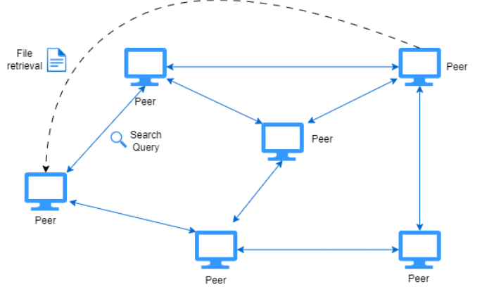

# Fully Distributed Peer-to-Peer File Sharing Network

## Introduction

A fully distributed peer-to-peer file sharing network allowing peers to share and search for files within the network, and download files directly among peers. This system aims to implement functionalities similar to those found in Gnutella.

## Functionalities

- Peers share files with the network without the need for central servers; they store peer (neighbor) pointers and file directories themselves.
- The network facilitates periodic heartbeat signals among peers to update their availability.
- Peers can search for files in the network using a gossip protocol.
- The system enables peer-to-peer file retrieval.
- Caching/distributed file directory and structured query routing.

## Architecture

## Evaluation

The system's effectiveness and reliability will be assessed through metrics:

- **Throughput**: To understand data transfer rates.
- **Latency**: To identify response times.
- **Success Rate**: To measure the efficiency of file transactions.
- **Scalability**: Observing system performance as the number of users grows.
- **Fault Tolerance**: Ensuring network robustness against failures.
