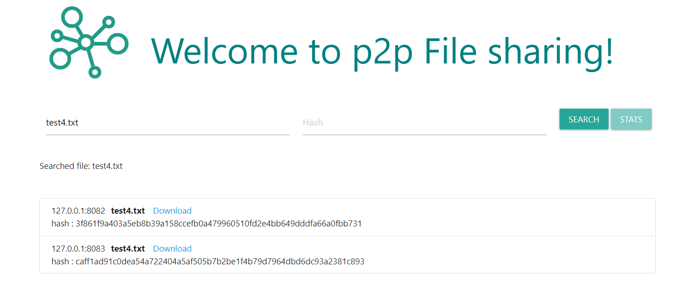
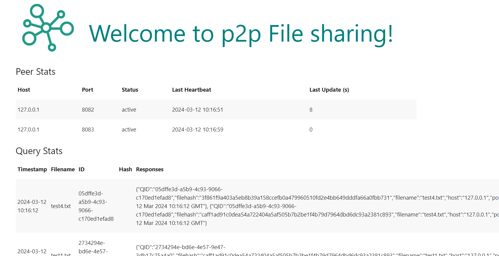

# Implementation

The system is built as a fully peer-to-peer (P2P) network that operates through an API, facilitating various operations such as joining the network, sharing and downloading files, and maintaining the network's health. It employs Flask, a Python web framework, for creating the API endpoints and APScheduler for scheduling periodic tasks. The system initializes a Flask application to serve as the backbone for the API. This API allows peers to communicate and perform actions like joining the network, sharing files, and retrieving file lists from other peers.


## Nodes

In the network, all participating entities are configured as peers, each with the capability to function both as a client and a server within the peer-to-peer architecture. 
When a peer acts as a client, it initiates requests to other peers in the network. Conversely, when a peer acts as a server, it responds to requests from other peers. 
Communication between these peers is facilitated through a defined set of APIs and through them, peers can send HTTP requests to each other, adhering to the client-server model, thus maintaining the network's collaborative and distributed nature.


## Components and Operations

### Scheduling Tasks
Using APScheduler, the system schedules regular tasks to keep the network updated and operational. These include updating the list of shared files every 30 seconds, sending heartbeat signals to indicate a peer is alive, and checking the liveness of peers to maintain network integrity.

### Peer Management
The system manages peers using a PeerManager, which keeps track of active peers in the network. This component allows new peers to join through the `/join` endpoint and supports peer liveness checks.


### File Management
FileManager handles file-related operations, including updating and sharing files among peers. It interacts with the file system to manage the files shared across the network.

### Query Management
 QueryManager processes file queries within the network. When a peer requests a file, this component handles the query, possibly forwarding it to other peers if the file is not found locally. This operation utilizes threading to handle multiple queries concurrently, ensuring efficient network operation.

### Heartbeat and Liveness Checks
Peers regularly send heartbeat signals to indicate they are active. The system also periodically checks if peers are still responsive, removing inactive ones to maintain network health.

### File Sharing and Downloading
Peers request files using the `/query` endpoint and download files through the `/download/<filename>` endpoint, supporting direct file transfers between peers.

## Concepts

- **Peer-to-peer distributed:** A network architecture without central servers, where each node acts as both a client and server.
- **Gossip/flooding protocol:** Facilitates communication through information replication and propagation from one node to others.
- **Threading:** Employed to efficiently and asynchronously handle incoming query requests.
- **UUID:** Utilizes Universally Unique Identifiers to uniquely identify each query.
- **SHA256 Hashing:** Ensures file uniqueness within the network by generating a SHA256 hash of each file's contents.
- **HTTP requests:** Enable peer communication and data exchange within the network.

## Methodology

### Query Requests
A query request is initiated by a peer seeking a specific file, containing the file's name and a unique hash to locate it within the network. The `/query` endpoint processes incoming queries, first checking the local repository for a match.

### Query processing 
The endpoint `/query`  is designed to process incoming file queries from peers. When a query request is received, the system first checks if the requested file, identified by its filename and hash, is available in the local shared directory. This process involves comparing the query parameters against the locally stored file metadata to determine if a match exists.

If the file is found locally, the system generates a `/query_hit` response, indicating the file's availability. This response includes the file's details and the hosting peer's network information, allowing the querying peer to directly contact the host for file download. The successful identification of the file and the subsequent generation of a query hit are logged for monitoring and debugging purposes.

In cases where the file is not found locally, the query needs to be propagated to other peers in the network to extend the search. The system forwards the query to connected peers, excluding the original sender, to prevent query loops. This forwarding process decreases the query's time-to-live (TTL) counter, a mechanism to limit the query's propagation range and prevent network flooding. The act of forwarding the query to other peers is also logged, providing visibility into the query's lifecycle and the network's response to file requests.


### Query Hits
Upon a successful file search within the network, a "query hit" message is sent back to the querying peer, indicating the file's availability and the hosting peer's details. This enables the querying peer to connect directly with the host for file downloading.

### File Downloading
File downloading is initiated upon receiving a query hit response, providing the file's location details. The peer establishes a direct connection with the hosting peer for the file transfer.


# Evaluation

## Fault Tolerance

Each peer maintains a dynamic list of neighboring peers, which is periodically updated. This ensures network consistency against node failures, as peers can adapt by connecting to available neighbors.The availability of peers is monitored through periodic heartbeat signals. These heartbeats help in identifying unresponsive or failed peers, allowing the network to maintain a reliable list of active participants.In the event a requested file is not found within a peer's local or immediate neighbor's storage, the query is forwarded to other peers in the network. This propagation mechanism enhances the network's fault tolerance by increasing the likelihood of locating the file elsewhere, despite failures or unavailability of some nodes.

## Results 

### Query Search and Results

Searches on the p2p File Sharing platform can be performed at http://localhost:8081/, where search results are readily accessible. When a file is located, (When `query hit`), the system displays a list of all peers that have the file. Each listing provides the file's name linked for downloading, the IP address of the peer where the file is located, and the unique hash of the file. 




### Peer and Query statistics

The statistics page, located at `http://localhost:8081/stats`, presents a detailed overview of the system's performance, including peer and query metrics. The peer stats section lists individual peers with their respective IP addresses and ports. For example, 127.0.0.1 on ports 8082 and 8083, both of which are currently active. It also shows the time of the last heartbeat, confirming their active status, and the last update in seconds, indicating how recently the status was confirmed.

The query stats section details recent file searches within the network. It logs the timestamp of the query, the filename requested, a unique query ID, the associated file hash, and the responses from the network. For instance, a search was made for "test4.txt" at the timestamp 2024-03-12 10:16:12, resulting in responses with detailed information such as file hashes and the responding host's IP address and port number.



# Deployment

## Install Libraries

```shell
pip3 install -r requirements.txt
```
## Update Configurations
### File Configs
`__C.file.chunk_size`: Specifies the chunk size in bytes for file processing.

`__C.file.shared_directory`: Path to the directory for storing sharable files.

`__C.file.save_directory`: Path to the directory for storing downloaded files.

### Peer Configs
`__C.peer.configuration`: Contains the current node's network address/port and initial set of known peer addresses.

```json
{
    "self": {
        "host": "0.0.0.0",
        "port": 8081
    },
    "peers": [
        {"host": "0.0.0.0", "port": 8082},
        {"host": "0.0.0.0", "port": 8083},
        {"host": "0.0.0.0", "port": 8084}
    ]
}
```


## Usage

Start the service of a single peer:

```shell
python app.py
```
